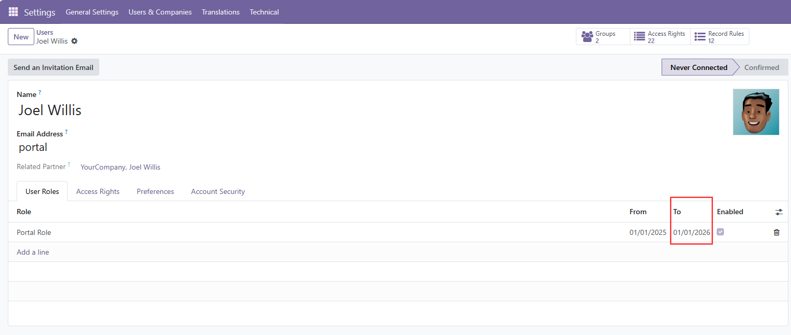
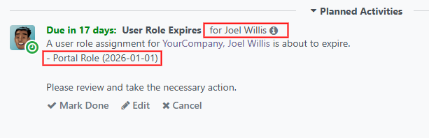

# System Parameter

The activity is created `base_user_role_activity.reminder_days = 30` (days) before the end date by a scheduled action "User role expire reminder" and automatically removed when assignment end date on the user role assignment is adapted.

# Activity
When a user role is about to expire (default=30 days), an activity is created for the manager of a user (employee). When the user has no Manager, the activity is assigned to user. The activity is linked to the users res.partner entity.

